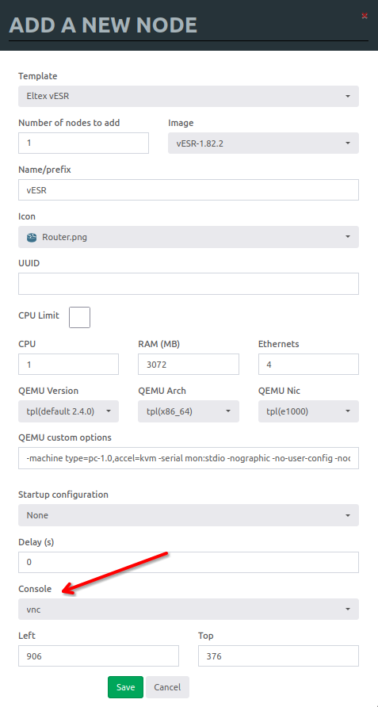
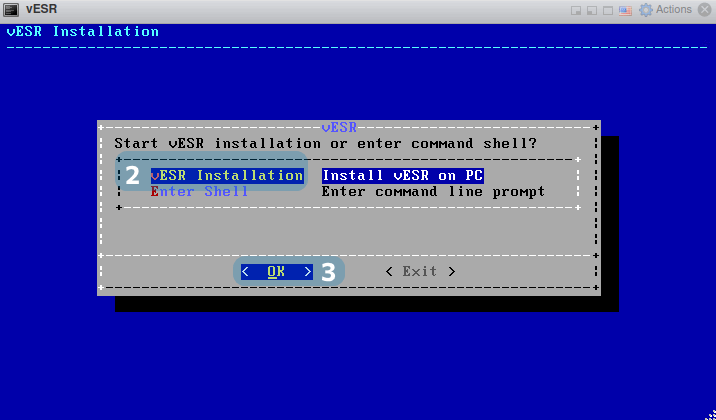
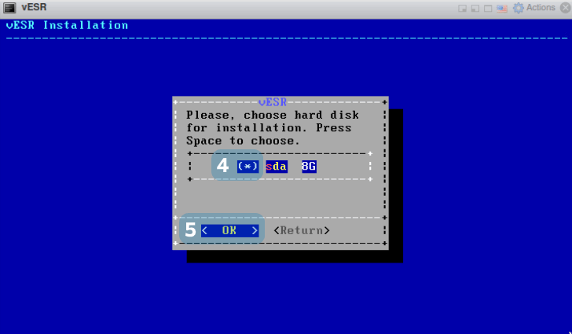
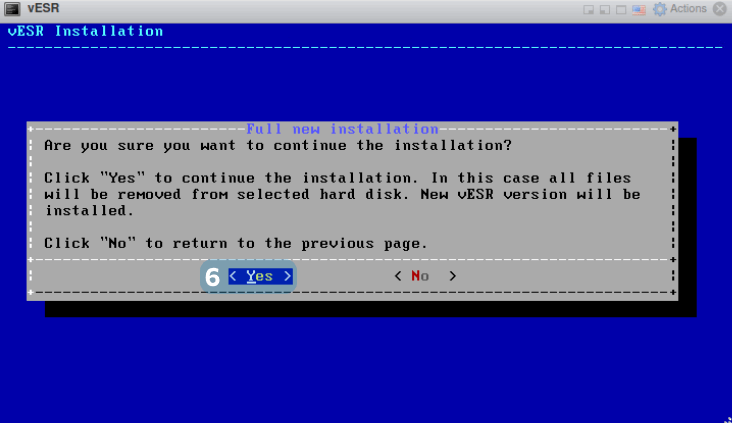
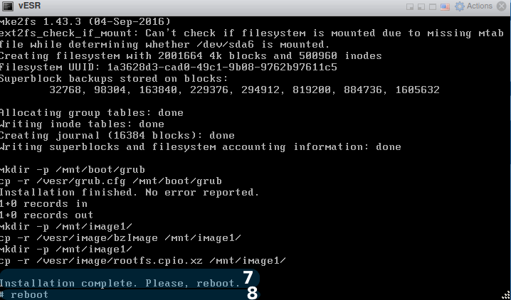
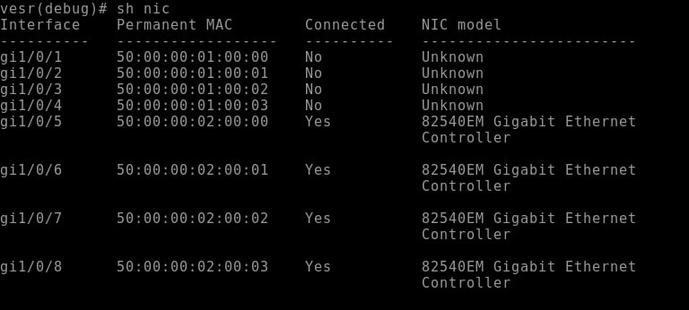

# Добавляем Eltex vESR в EVE-NG

## Требовани

Данная инструкция проверялась на EVE-NG 5.0.1-19-Community и с образом vesr-1.18.2-build3. Образ необходимо запросить напрямую у ELTEX.
Скрипт и шаблоны неофициальные, делал для себя, но возможно кому-то будут полезны.


## Подготавливаем шаблон

Из папок **templates** и  **templates_legacy**  копируем файлы в соответствующие папки на **EVE-NG**:</br>
`scp ./templates_legacy/vesr.yml root@ip_address_eve_ng:/opt/unetlab/html/templates_legacy/vesr.yml`</br>
`scp ./templates/amd/vesr.yml root@ip_address_eve_ng:/opt/unetlab/html/templates/amd/vesr.yml`</br>
`scp ./templates/intel/vesr.yml root@ip_address_eve_ng:/opt/unetlab/html/templates/intel/vesr.yml`

Чтобы шаблон отображался в web-интерфейсе выполняем следующие на сервере с **EVE-NG**:

`cp /opt/unetlab/html/includes/custom_templates.yml.distribution /opt/unetlab/html/includes/custom_templates.yml`

И изменяем его содержимое на следующие:

```
custom_templates:
  - name: vESR
    listname: Eltex vESR
...
```

## Подготовка образа 

Для того чтобы создать свой собственный образ **Eltex vESR** необходимо выполнить следующие действия.

1. Создаем папку с нашим будущим шаблоном: 

 ```console
    # mkdir /opt/unetlab/addons/qemu/vESR-1.82.2
```

2. Создаем образ диска в созданной директории:

```console
   # /opt/qemu/bin/qemu-img create -f qcow2 hda.qcow2 1G
```

3. Копируем iso образ Eltex vESR в ту же папку и называем его cdrom.iso:

```console
   # scp ./vESR-1.8.2-build3.iso  root@ip_address_eve_ng:/opt/unetlab/addons/qemu/vESR-1.8.2/cdrom.iso
```

## Экспорт конфигурации

Чтобы можно было делать экспорт конфигураций нам необходимо написать скрипт для имопрта/экспорта конфигурации. Данный скрипт копируем в  **EVE-NG**:

`cp ./scripts/config_vesr.py root@ip_address_eve_ng:/opt/unetlab/scripts/config_vesr.py`

Правим права на добавленные файлы:

```console
# /opt/unetlab/wrappers/unl_wrapper -a fixpermissions
```

## Установка vESR

В нашем шаблоне тип подключения выбран **telnet**, при таком типе подключения мы не сможем выполнить утановку с диска. Поэтому при первом добавлении ноды, указываем типа подключения как **VNC**:



Дальше выполняем установку **vESR**:

1)  Дождитесь окончания таймера или нажмите "Enter".


2) Используя клавиши "↑, ↓", выберите пункт "vESR Installation".

3) Используя клавиши "←, →", выберите пункт "OK" и нажмите клавишу "Enter".



4) Нажмите клавишу "Space", после появится символ "*".

5) Используя клавиши "←, →", выберите пункт "OK" и нажмите клавишу "Enter".



6) Используя клавиши "←, →" выберите пункт "Yes"и нажмите клавишу "Enter".



7) После установки вы увидите надпись "Installation complete. Please, reboot".

8) Введите в командной строке "reboot" и нажмите клавишу "Enter".



Вы успешно выполнили установку vESR.

## Фиксация изменений.

При запуске **qemu** создается снимок диска в директории `/opt/unetlab/tmp/`, в который пишутся только изменения относительно родительского образа, соответственно поэтому все изменения после удаления хоста стираются. Но мы можем их закоммитить в изначальный образ, тем самым закрепив изменения в родительском образе. Таким образом можно насоздавать кучу разных презаготовленных образов довольно просто манипулируя файлами в директории `/opt/unetlab/addons/qemu/`. Это необходимо сделать, что каждый раз не выполнять установку, и не задавать пароль. Поэтому после установки и установки пароля, делаем фиксацию изменений

Обычно путь к файлу снимка выглядит примерно так:

`/opt/unetlab/tmp/0/3491e0a7-25f8-46e1-b697-ccb4fc4088a2/1/hda.qcow2`

Чтобы убедиться, снимок от какого родительского образа выполнен в этой директории, можно выполнить команду

```console
# /opt/qemu/bin/qemu-img info hda.qcow2
image: hda.qcow2
file format: qcow2
virtual size: 614M (643825664 bytes)
disk size: 196K
cluster_size: 65536
backing file: /opt/unetlab/addons/qemu/vESR-1.8.2/hda.qcow2
```

Убедившись, что образ сделан из нужного родительского образа, мы можем выполнить коммит его, тем самым закрепив изменения в родитеском образе.

```console
# /opt/qemu/bin/qemu-img commit hda.qcow2
Image committed.
```

После этого нужно выключить и заново загрузить хост, который теперь всегда по умолчанию будет стартовать с изменениями, сделанными до коммита.

## Использование нескольких экземпляров в одной лабе

При оспользовании нескольких экземпляров **vESR** в одной лабе, некорректно создаются интерфейсы. Единственный  способ который саботал, это ручное переименование NIC.



Заходим в режим **debug**, смотрим что выводит команда `sh nic`, а дальше переименовываем как нам надо:

```
vesr(debug)# nic bind mac 50:00:00:02:00:00 gigabitethernet 1/0/1
```

И перезагружаем для применения изменений `vesr# reload system `. В самой лабе ноду тоже надо остановить/запустить.