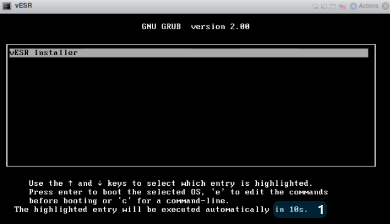

# Добавляем Eltex vESR в EVE-NG

- [Добавляем Eltex vESR в EVE-NG](#добавляем-eltex-vesr-в-eve-ng)
   * [Требовани](#требовани)
   * [Подготавливаем шаблон](#подготавливаем-шаблон)
   * [Экспорт конфигурации](#экспорт-конфигурации)
   * [Подготовка образа](#подготовка-образа)
      + [Подготавливаем образ в Proxmox (предпочтительный вариант)](#подготавливаем-образ-в-proxmox-(предпочтительный-вариант))
         - [Установка vESR](#установка-vesr)
         - [Настройка Virtual Serial](#настройка-virtual-serial)
         - [Создание образа qcow2](#создание-образа-qcow2)
      + [Подготавливаем образ в EVE](#подготавливаем-образ-в-eve)
         - [Установка vESR на EVE](#установка-vesr-на-eve)
         - [Фиксация изменений](#фиксация-изменений)
   * [Использование нескольких экземпляров в одной лабе (Если подготавливали образ в самой EVE)](#использование-нескольких-экземпляров-в-одной-лабе-если-подготавливали-образ-в-самой-eve)

## Требовани

Данная инструкция проверялась на EVE-NG 5.0.1-19-Community и с образом vesr-1.18.2-build3. Образ необходимо запросить напрямую у ELTEX.
Скрипт и шаблоны неофициальные, делал для себя, но возможно кому-то будут полезны.


## Подготавливаем шаблон

Из папок **templates** и  **templates_legacy**  копируем файлы в соответствующие папки на **EVE-NG**:</br>

`scp ./templates_legacy/vesr.yml root@ip_address_eve_ng:/opt/unetlab/html/templates_legacy/vesr.yml`</br>
`scp ./templates/amd/vesr.yml root@ip_address_eve_ng:/opt/unetlab/html/templates/amd/vesr.yml`</br>
`scp ./templates/intel/vesr.yml root@ip_address_eve_ng:/opt/unetlab/html/templates/intel/vesr.yml`

Чтобы шаблон отображался в web-интерфейсе выполняем следующие на сервере с **EVE-NG**:

`cp /opt/unetlab/html/includes/custom_templates.yml.distribution /opt/unetlab/html/includes/custom_templates.yml`

И изменяем его содержимое на следующие:

```
custom_templates:
  - name: vesr
    listname: Eltex vESR
...
```

## Экспорт конфигурации

Чтобы можно было делать экспорт конфигураций нам необходимо написать скрипт для имопрта/экспорта конфигурации. Данный скрипт копируем в  **EVE-NG**:

`cp ./scripts/config_vesr.py root@ip_address_eve_ng:/opt/unetlab/scripts/config_vesr.py`

## Подготовка образа

Создаем папку с нашим будущим шаблоном: 

 ```console
    # mkdir /opt/unetlab/addons/qemu/vesr-1.82.2
```

### Подготавливаем образ в Proxmox (предпочтительный вариант)

Дело в том, что при созданиии образа в самой EVE сетевые интерфейсы получают MAC-адреса, и при фиксации изменений они сохраняются в образе. Именно поэтому если переиспользовать этот образ для создания двух нод происходит ситуация, при которой неправильно создаются сетевые интерфейсы. Я не смог выйти из этой ситуации использую только EVE. Если вы можете подсказать как это сделать, напишите мне, буду признателен!

У производителя есть [вебинар](https://www.youtube.com/watch?v=F_qDC7slNzY&t=960s) о том как установаить **vESR** на **Proxmox**. Но в нашем случае есть **важное** отличие. Мы создаем виртуалку вообще с отсутствующими сетевыми интерфейсами. Когда доходим до вкладки **Network** ставим чекбокс напротив **No network device**. Делается это все для того, чтобы как раз избежать проблемы неправильного создания сетевых интерфейсов. 

#### Установка vESR


1)  Дождитесь окончания таймера или нажмите "Enter".



2) Используя клавиши "↑, ↓", выберите пункт "vESR Installation".

3) Используя клавиши "←, →", выберите пункт "OK" и нажмите клавишу "Enter".


4) Нажмите клавишу "Space", после появится символ "*".

5) Используя клавиши "←, →", выберите пункт "OK" и нажмите клавишу "Enter".


6) Используя клавиши "←, →" выберите пункт "Yes"и нажмите клавишу "Enter".


7) После установки вы увидите надпись "Installation complete. Please, reboot".

8) Введите в командной строке "reboot" и нажмите клавишу "Enter".


Вы успешно выполнили установку vESR.

После установки необходимо установить новый пароль.

#### Настройка Virtual Serial

Так как у нас в шаблоне тип  подключения стоит **telnet**, мы не видим процесс загрузки устройства до полной загрузки. Исправим это.

Для того чтобы при подключении через Serial Port в консоли отображались логи, необходимо произвести дополнительные настройки.

1) Перейдите в режим глобальной конфигурации.

```
vesr# config
```

2) Перейдите в syslog console.

```
vesr(config)# syslog console
```

3) Включите виртуальный Serial Port командой virtual serial.

```
vesr(config-syslog-console)# virtual-serial
```

4) Примените конфигурацию.

```
vesr# commit
vesr# confirm
```

5) Перезагрузите устройство.

```
vesr# reload system
```

После перезагрузки при подключении по Serial Port логи будут отображаться в консоли.

#### Создание образа qcow2

Сначала  определяем место положение виртуального диска: </br>

```
pvesm path local-lvm:vm-109-disk-0
``` 

Где **local-lvm** - пул хранения виртуальных дисков, а **vm-109-disk-0** соответственно виртуальный диск.

Консоль должна вернуть подобное: 

```
/dev/pve/vm-109-disk-0
```

Это значение искользуем для следующей команды:

```
qemu-img convert -O qcow2 -f raw /dev/pve/vm-112-disk-0 hda.qcow2
```

Вот и все. Мы получили образ **hda.qcow2**. Осталось скопировать его любым удобным для вас способом в папку **/opt/unetlab/addons/qemu/vesr-1.82.2** на сервере EVE. 

Правим права на добавленные файлы:

```console
# /opt/unetlab/wrappers/unl_wrapper -a fixpermissions
```

### Подготавливаем образ в EVE

Для того чтобы создать свой собственный образ **Eltex vESR** необходимо выполнить следующие действия.

1. Создаем папку с нашим будущим шаблоном: 

 ```console
    # mkdir /opt/unetlab/addons/qemu/vesr-1.82.2
```

2. Создаем образ диска в созданной директории:

```console
   # /opt/qemu/bin/qemu-img create -f qcow2 hda.qcow2 1G
```

3. Копируем iso образ Eltex vESR в ту же папку и называем его cdrom.iso:

```console
   # scp ./vESR-1.82.2-build3.iso  root@ip_address_eve_ng:/opt/unetlab/addons/qemu/vesr-1.82.2/cdrom.iso
```

#### Установка vESR на EVE

В нашем шаблоне тип подключения выбран **telnet**, при таком типе подключения мы не сможем выполнить утановку с диска. Поэтому при первом добавлении ноды, указываем типа подключения как **VNC**:


Дальше выполняем установку как в пункте [Установка vESR](#установка-vesr) для Proxmox

Вы успешно выполнили установку vESR.

После установки необходимо установить новый пароль.

Далее рекомендую так же [настроить Virtual Serial](#настройка-virtual-serial)

Правим права на добавленные файлы:

```console
# /opt/unetlab/wrappers/unl_wrapper -a fixpermissions
```

#### Фиксация изменений

При запуске **qemu** создается снимок диска в директории `/opt/unetlab/tmp/`, в который пишутся только изменения относительно родительского образа, соответственно поэтому все изменения после удаления хоста стираются. Но мы можем их закоммитить в изначальный образ, тем самым закрепив изменения в родительском образе. Таким образом можно насоздавать кучу разных презаготовленных образов довольно просто манипулируя файлами в директории `/opt/unetlab/addons/qemu/`. Это необходимо сделать, что каждый раз не выполнять установку, и не задавать пароль. Поэтому после установки и установки пароля, делаем фиксацию изменений

Обычно путь к файлу снимка выглядит примерно так:

`/opt/unetlab/tmp/0/3491e0a7-25f8-46e1-b697-ccb4fc4088a2/1/hda.qcow2`

Чтобы убедиться, снимок от какого родительского образа выполнен в этой директории, можно выполнить команду

```console
# /opt/qemu/bin/qemu-img info hda.qcow2
image: hda.qcow2
file format: qcow2
virtual size: 614M (643825664 bytes)
disk size: 196K
cluster_size: 65536
backing file: /opt/unetlab/addons/qemu/vESR-1.82.2/hda.qcow2
```

Убедившись, что образ сделан из нужного родительского образа, мы можем выполнить коммит его, тем самым закрепив изменения в родитеском образе.

```console
# /opt/qemu/bin/qemu-img commit hda.qcow2
Image committed.
```

После этого нужно выключить и заново загрузить хост, который теперь всегда по умолчанию будет стартовать с изменениями, сделанными до коммита.

## Использование нескольких экземпляров в одной лабе (Если подготавливали образ в самой EVE)

При оспользовании нескольких экземпляров **vESR** в одной лабе, некорректно создаются интерфейсы. Единственный  способ который сработал, это ручное переименование NIC.


Заходим в режим **debug**, смотрим что выводит команда `sh nic`, а дальше переименовываем как нам надо:

```
vesr(debug)# nic bind mac 50:00:00:02:00:00 gigabitethernet 1/0/1
```

И перезагружаем для применения изменений `vesr# reload system `. В самой лабе ноду тоже надо остановить/запустить.
